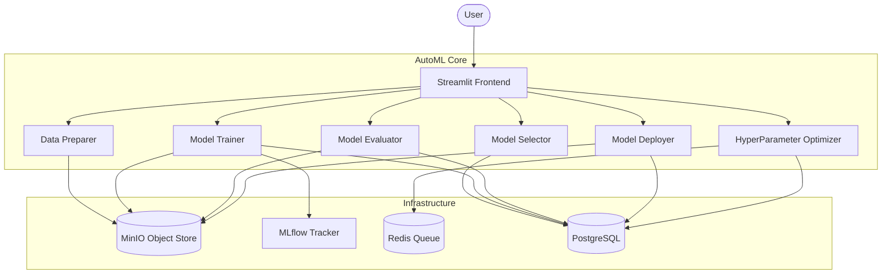

# 🤖 Distributed AutoML Platform

A powerful, modular, and distributed AutoML platform built with a microservices architecture. This platform allows users to upload datasets, get AI-powered model recommendations, perform hyperparameter optimization, and deploy models as production-ready REST APIs.

---

## 🏗️ Architecture Overview

The platform is designed around independent microservices communicating via REST APIs and event-driven patterns.



---

## 🛠️ Technology Stack

- **Backend**: Python (Flask, PyTorch, Scikit-learn, Ray)
- **Frontend**: Streamlit
- **Infrastructure**:
    - **Object Storage**: MinIO (S3 Compatible)
    - **Experiment Tracking**: MLflow
    - **Database**: PostgreSQL (Independent DBs per service)
    - **Message Broker**: NATS
    - **Caching/Task Queue**: Redis
- **DevOps**: Docker & Docker Compose

---

## 🔌 Microservices & Ports

| Service            | Port (Host) | Description                                                                 |
|--------------------|-------------|-----------------------------------------------------------------------------|
| **Frontend**       | `8501`      | Main UI for interacting with the platform.                                  |
| **Data Preparer**  | `8001`      | Data cleaning, imputation, and feature engineering.                         |
| **Model Selector** | `8002`      | Recommends best ML models based on dataset characteristics.                 |
| **Trainer**        | `8003`      | High-performance training (PyTorch/Ray) with MLflow logging.                |
| **Evaluator**      | `8004`      | Deep performance analysis and interactive comparative plots.                |
| **HyperOpt**       | `8005`      | automated Hyperparameter optimization (TPE/Random Search).                  |
| **Deployer**       | `8006`      | Packages models for REST (TorchServe), Batch, or Edge.                      |
| **Adminer**        | `8090`      | Web interface for managing all service databases.                         |
| **MLflow**         | `5000`      | Experiment tracking and model registry UI.                                  |
| **MinIO Console**  | `9001`      | UI for browsing datasets and model artifacts.                               |

---

## 🚀 Getting Started

### Prerequisites
- Docker & Docker Compose
- 8GB RAM (Minimum) / 16GB (Recommended)

### Installation
1. Clone the repository.
2. Launch the infrastructure:
   ```bash
   docker-compose up -d --build
   ```
3. Access the Frontend at [http://localhost:8501](http://localhost:8501).

---

## 🔄 The Automated Workflow

The platform features an **Automated Data Flow** mechanism. You don't need to copy-paste IDs manually between steps:

1.  **📊 Data Preparation**: Upload a CSV. Once processed, a `Dataset ID` is generated and automatically shared with all other views.
2.  **🤖 Model Selection**: Select your target column. The service recommends the best models. Triggering training starts a `Batch Job`.
3.  **🚀 Training Monitor**: Track your training jobs in real-time. Upon completion, model artifacts are saved to MinIO and logged in MLflow.
4.  **📈 Model Evaluation**: Deeply compare trained models through interactive charts. Selecting a model prepares it for deployment.
5.  **🧪 HyperOpt**: Refine your best model with advanced optimization techniques.
6.  **📦 Model Deployment**: Deploy your best model with one click as a **TorchServe REST API**.

---

## 🔐 Communication Principles

- **API-Only**: Microservices communicate exclusively through standard REST APIs.
- **Shared IDs**: The system uses persistent `Dataset ID`, `Job ID`, and `Model ID` to chain operations.
- **Independence**: Each microservice manages its own schema and data in dedicated PostgreSQL instances.
- **Scalability**: The Trainer is built to scale across multiple workers (GPUs/CPUs) via Ray.

---

## 📂 Project Structure

```text
.
├── services/
│   ├── data_preparer/   # Python/Flask
│   ├── model_selector/  # Python/Flask
│   ├── trainer/         # Python/PyTorch/Ray
│   ├── evaluator/       # Python/Plotly
│   ├── hyperopt/        # Python/Optuna/Redis
│   ├── deployer/        # Python/TorchServe
│   ├── orchestrator/    # Node.js/TypeScript
│   └── frontend/        # Streamlit
├── deployments/         # Local deployment artifacts
└── docker-compose.yml   # Multi-service orchestration
```
